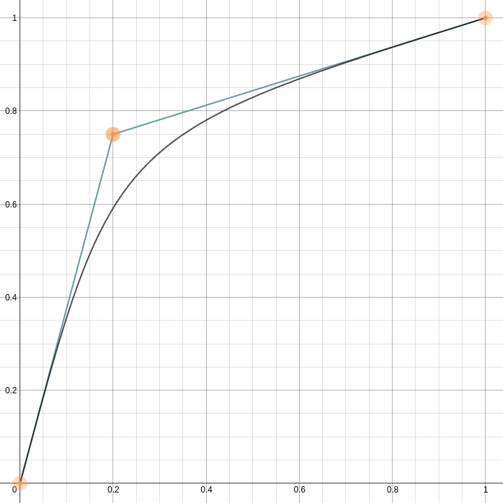

# Architecture

The `npms-analyzer` runs two continuous and distinct processes. One is the `analysis` process where each package gets inspected and evaluated. The other one is the `continuous scoring` process where all packages get a score based on the aggregated evaluation results.

- [Analysis](#analysis)
- [Continuous scoring](#continuous-scoring)

## Analysis

The analysis process analyzes the `npm` packages, producing a result and a score.

By looking at the diagram above, you get an idea of how the analysis process works. Below you may find a more detailed description for the most complex components. The `grey` components are present in `lib`.

### Observers

Observers continuously push packages to the queue whenever they see fit.

- realtime - Observes the replicated `npm` registry for changes, pushing new or updated packages into the analyze queue.
- stale - Fetches packages that were not analyzed for some time, pushing them to the queue.

The packages reported by the `realtime` have priority over the other observers, so that recently published packages are analyzed first.  

### Queue

The queue holds all packages that are waiting to be analyzed. This component gives us:

- Burst protection
- No loss of packages on crashes or failures
- Automatic retries

### Analyze

The analyze is a simple pipeline that produces an analysis result:

1. Fetches the package data
2. Downloads the source code
3. Runs the Collectors
4. Runs the evaluators
5. Stores the result in CouchDB and Elasticsearch

Below you may find additional information on the collectors and evaluators.

#### Collectors

The collectors are responsible for gathering useful information about each package from a variety of sources:

- metadata
- source
- github
- npm

##### metadata

The metadata collector extracts basic data and attributes of a package.

- Extract package name, description and keywords
- Extract package author, maintainers and contributors
- Extract the license
- Get releases timing information
- Extract repository and homepage
- Extract README
- Extract the package dependencies
- Check if the package is deprecated
- Check if the package has a test script

##### source

The source collector digs into the source code.

- Check certain files: `.npmignore`, `.gitignore`, `.gitattributes`, README size, tests size, etc
- Detect linters, such as `eslint`, `jshint`, `jslint` and `jscs`
- Detect badges in the README
- Compute code complexity *
- Grab the code coverage %
- Get repository file size
- Get dependencies insight, including if they are outdated
- Search for tech debts: TODOs, FIXMEs, etc *
- Get security insight with node security project

Items signaled with * are not yet done.

##### github

The github collector uses GitHub to collect useful data and statistics present there.

- Get number of stars, subscribers and forks
- Fetch the repository activity in terms of commits
- Fetch the number of issues and their distribution over time
- Extract the homepage
- Fetch contributors
- Check the build status

This collector is susceptible to the GitHub [rate limit](https://developer.github.com/v3/rate_limit/) policy. To fight against this limit, you may define several GitHub keys in the config to be used in a round-robin fashion.

##### npm

The npm collector uses the replicated CouchDB views and the npm [download-counts](https://github.com/npm/download-counts) API to extract useful information present there.

- Get number of stars
- Get number of downloads over time
- Get number of dependents

#### Evaluators

The evaluators take the information that was previously collected and evaluate different aspects of the package. These aspects are divide in four categories:

- quality
- popularity
- maintenance
- personalities

Evaluators may further divide each of these aspects into more granular ones, but their values are always scalars.

##### quality

Quality attributes are easy to calculate because they are self contained. These are the kind of attributes that a person looks first when looking at the package.

Below are some of the points taken into consideration:

- Has README? Has license? Has .gitignore and friends?
- Is the version stable (> 1.x.x)? Is it deprecated?
- Has tests? Whats their coverage %? Is build passing?
- Has outdated dependencies? Do they have vulnerabilities?
- Has custom website? Has badges?
- Does the project have linters configured?
- What's the code complexity score?

##### maintenance

Maintenance attributes allows us to understand if the package is active & healthy or if it is abandoned. These are typically the second kind of attributes that a person looks when looking at the package.

Below follows some of the points taken into consideration:

- Ratio of open issues vs the total issues
- The time it takes to close issues
- Most recent commit
- Commit frequency

##### popularity

Popularity attributes allows us to understand the package adoption and community size. These are the kind of attributes that a person looks when they are undecided on the package choice.

Below follows some of the points taken into consideration:

- Number of stars
- Number of forks
- Number of subscribers
- Number of contributors
- Number of dependents
- Number of downloads
- Downloads acceleration

##### personalities

If two packages are similar, one tend to choose the one in which the author is well known in the community. While this doesn't directly translate to quality, it's still a strong factor that we should account.

Relationships between people are also important. When an user follows another, there's a bound between them. We can infer that people prefer packages from the users they follow.

I will not elaborate on this because this evaluator will NOT be developed nor used in the initial release.

### Scoring

Calculates the package score based on the current aggregation if any. If there's no aggregation, the package won't be scored at the moment, but it will be later in the `continuous scoring` process.

## Continuous scoring

The continuous scoring process runs once in a while to score all `npm` packages, indexing the score data in `Elasticsearch` to be searchable.

By looking at the diagram above, you get an idea of how the continuous scoring process works. Below you may find a more detailed description for each component. The `grey` components are present in `lib`.

One important detail is that the continuous scoring process creates and maintains two [aliases](https://www.elastic.co/guide/en/elasticsearch/reference/current/indices-aliases.html):

- `npms-current`: The index with the full data from the last completed scoring process
- `npms-new`: The index that the current scoring process is writing to

### Prepare

The prepare step creates a new index and updates the `npms-new` alias to point to that index. It also removes extraneous indices from previous failed cycles (if any).

### Aggregate

The aggregation step iterates all the packages evaluations, calculating the `min`, `max` and `mean` values for each evaluation. The aggregation is stored in CouchDB to also be used by the `analysis` process.

### Score packages

After having the aggregation done, all packages are iterated again to produce a score based on the previously calculated aggregation.

The package evaluation and aggregation `mean` are normalized ([0, 1]), using the aggregation `min` and `max` values, and a Bezier Curve is computed using 4 control points: (0, 0), (normalizedAggregationMean, 0.75), (normalizedAggregationMean, 0.75), (1, 1). The package score is the Y value that corresponds, in this curve, to the package evaluation (X axis).

The score data for each package are stored in `Elasticsearch` into both `npms-current` and `npms-new` indices.

### Finalize

The finalize step updates the `npms-current` alias to point to the newly populated index and deletes the `npms-new` alias and previous index.
