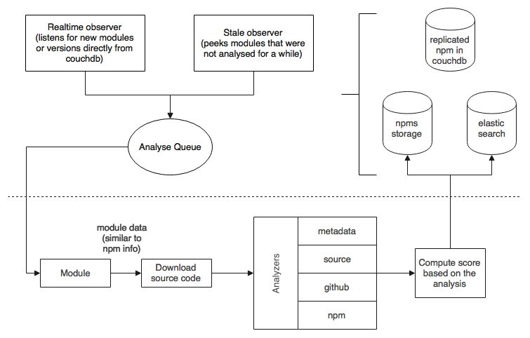

## Architecture

The `npms-analyzer` runs two continuous and distinct processes. One is the continuous analysis processes where each module gets
inspected and evaluated. The other one is the continuous process of scoring the modules, using the evaluation results.

- [Analysis](#analysis)
- [Scoring](#scoring)

### Analysis

### Collectors

The collectors are responsible for collecting useful information about each module. The collecting phase produces an
`info` object. The current collectors are:

- metadata
- source
- github
- npm

#### metadata

The metadata collector extracts basic data and attributes of a module.

- Extract module name, description and keywords
- Extract package author, maintainers and contributors
- Extract the license
- Get releases timing information
- Extract repository and homepage
- Extract README
- Extract the module dependencies
- Check if the module is deprecated
- Check if the module has a test script

#### source

The source collector digs into the source code.

- Check certain files: `.npmignore`, `.gitignore`, `.gitattributes`, README size, tests size, etc
- Detect linters, such as `eslint`, `jshint`, `jslint` and `jscs`
- Detect badges in the README
- Compute code complexity *
- Grab the code coverage %
- Get repository file size
- Get dependencies insight, including if they are outdated
- Search for tech debts: TODOs, FIXMEs, etc *
- Get security insight with node security project

Items signaled with * are not yet done.

#### github

The github collector uses GitHub and [Issue Stats](http://issuestats.com/) to collect useful data and statistics
present there.

- Get number of stars, subscribers and forks
- Fetch the repository activity in terms of commits
- Fetch the number of issues and their distribution over time
- Extract the homepage
- Fetch contributors
- Check the build status

This collector is susceptible to the GitHub [rate limit](https://developer.github.com/v3/rate_limit/) policy. To fight
against this limit, you may define several GitHub keys to be used in a round-robin fashion.

#### npm

The npm collector uses the replicated CouchDB views and the npm [download-counts](https://github.com/npm/download-counts)
API to extract useful information present there.

- Get number of stars
- Get number of downloads over time
- Get number of dependents

### Evaluation

The evaluation phased uses the `info` object that was previously collected to evaluate different aspects of the module. These aspects are divide in four categories:

- quality
- popularity
- maintenance
- personalities

#### quality

Quality attributes are easy to calculate because they are self contained. These are the kind of attributes that a person looks first when looking at the module.

- Has README?
- Has tests? has coverage? whats the coverage %?
- Is the version stable? (> 1.x.x)
- Is the module deprecated?
- Has continuous integration? is build passing?
- Has outdated dependencies?
- Has security vulnerabilities?
- Has custom website? has good branding? has badges?
- Does the project have linters configured?
- What's the code complexity score?

#### maintenance

Maintenance attributes allows us to understand if the module is active & healthy or if it is abandoned. These are typically the second kind of attributes that a person looks when looking at the module.

- Percentage of open issues among the total issues
- The time it takes to close the issues
- Most recent commit
- Commit frequency

#### popularity

Popularity attributes allows us to understand the module extend and adoption. These are the kind of attributes that a person looks when they are undecided on the module choice.

- Number of stars
- Number of forks
- Number of subscribers
- Number of contributors
- Number of dependents
- Number of downloads
- Downloads acceleration

#### personalities

If two modules are similar, one tend to choose the one in which the author is well known in the community. Also, there are people that simply prefer to use a module over another because the author is popular. While this doesn't directly translate to quality, it's still a strong factor that we should account.

I will not elaborate on this because this evaluator will NOT be developed nor used in the initial release.

## Scoring

TODO:
